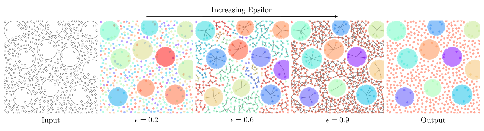
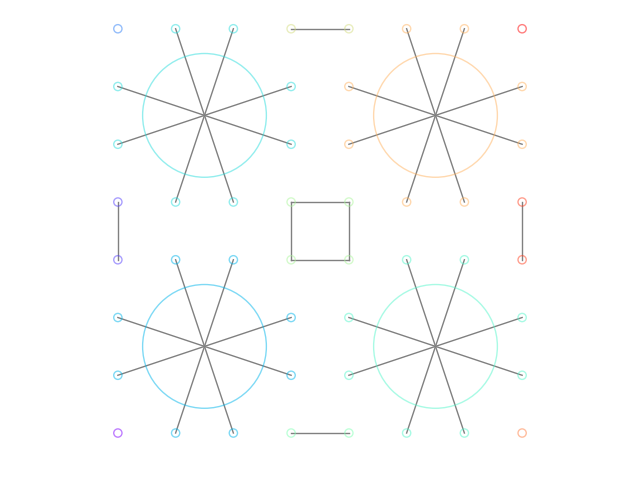
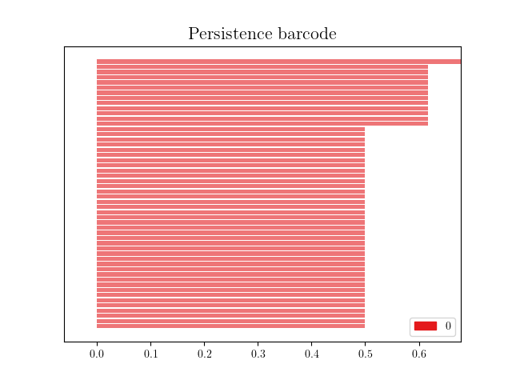
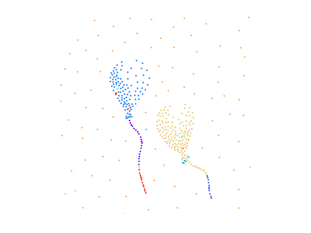
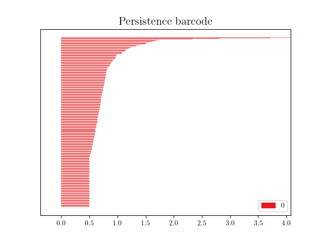
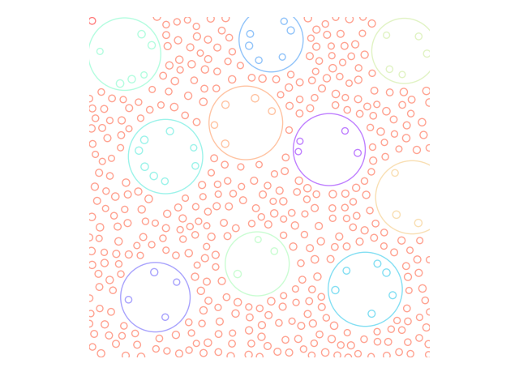
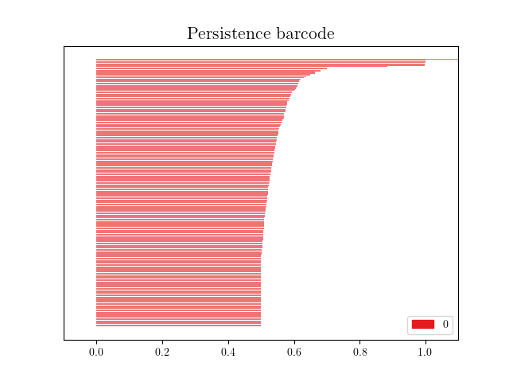

## SING: Stability-Incorporated Neighborhood Graph
SIGGRAPH Asia 2024<br>
Diana Marin, Amal Dev Parakkat, Stefan Ohrhallinger, Michael Wimmer, Steve Oudot, Pooran Memari

---

[[Paper]](https://dl.acm.org/doi/pdf/10.1145/3680528.3687674)



We introduce the Stability-Incorporated Neighborhood Graph (SING), a novel density-aware structure designed to capture the intrinsic geometric properties of a point set. We improve upon the spheres-of-influence graph by incorporating additional features to offer more flexibility and control in encoding proximity information and capturing local density variations. Through persistence analysis on our proximity graph, we propose a new clustering technique and explore additional variants incorporating extra features for the proximity criterion. Alongside the detailed analysis and comparison to evaluate its performance on various datasets, our experiments demonstrate that the proposed method can effectively <ins>extract meaningful clusters from diverse datasets with variations in density and correlation</ins>. Our application scenarios underscore the advantages of the proposed graph over classical neighborhood graphs, particularly in terms of parameter tuning.

# Dependencies
All the required libraries are provided in *requirements.txt*. You can install them by using:
```python
pip install -r requirements.txt
```

# Usage
```bash
python main.py --filename --filetype --epsilon --density --drawEdges
```

**Parameters:**
- *filename*: the input data, usually a list of 2D coordinates, sometimes with additional information per point e.g. radius
- *filetype*: the type of input data, which can be '**stipples**', '**disks**' or '**species**'. Stipples files only contain 2D coordinates of each point, disks files contain points which a given radius, while species files are examples from [[Ecormier-Nocca et al. 2019]](https://inria.hal.science/hal-02064699/document), of points with radius and certain other properties which are ignored for our use case
- *epsilon*: (optional) the default value is 1.0
- *density*: (optional) the exponent for the density-aware variant of SING, default value is 0.0, which ignores the density component
- *drawEdges*: (optional) drawing the SING edges on top of the classes


The application plots the clustering using the given arguments, and the persistence diagram.

# Example outputs
We present some example outputs of our code. On the left, we showcase the SING graph and its connected components, each in a different color. On the right, the persistence diagram is plotted.
- **Disks** - the input is defined as a collection of disks, each with a position and a radius value.
  ```bash
  python main.py --
        --filename examples/disks/pattern_data.txt 
        --filetype disks 
        --drawEdges True 
        --epsilon 0.55
  ```
  | SING | Persistence Barcode |
  |---------|---------|
  |  |  |

- **Stipples** - each stipple is defined by its 2D coordinate.
  ```bash
  python main.py 
         --filename examples/stipples/Balloon.csv 
         --filetype stipples 
         --density 1.5 
         --epsilon 1.4
  ```
  | SING | Persistence Barcode |
  |---------|---------|
  |  |  |
- **Species** - similar to disks, each input line contains the 2D coordinate, the radius, as well as species-related information (class), that is not used in our code.
  ```bash
  python main.py 
         --filename examples/species/toy_forest_in.txt 
         --filetype species 
         --epsilon 0.9
  ```
  | SING | Persistence Barcode |
  |---------|---------|
  |  |  |


# Cite
```bibtex
@inproceedings{marin2024sing,
  title={SING: Stability-Incorporated Neighborhood Graph},
  author={Marin, Diana and Parakkat, Amal Dev and Ohrhallinger, Stefan and Wimmer, Michael and Oudot, Steve and Memari, Pooran},
  booktitle={SIGGRAPH Asia 2024 Conference Papers},
  pages={1--10},
  year={2024}
}
```

# License

This work is licensed under a  
[Creative Commons Attribution 4.0 International License][cc-by].

[![CC BY 4.0][cc-by-image]][cc-by]

[cc-by]: http://creativecommons.org/licenses/by/4.0/
[cc-by-image]: https://i.creativecommons.org/l/by/4.0/88x31.png
[cc-by-shield]: https://img.shields.io/badge/License-CC%20BY%204.0-lightgrey.svg
